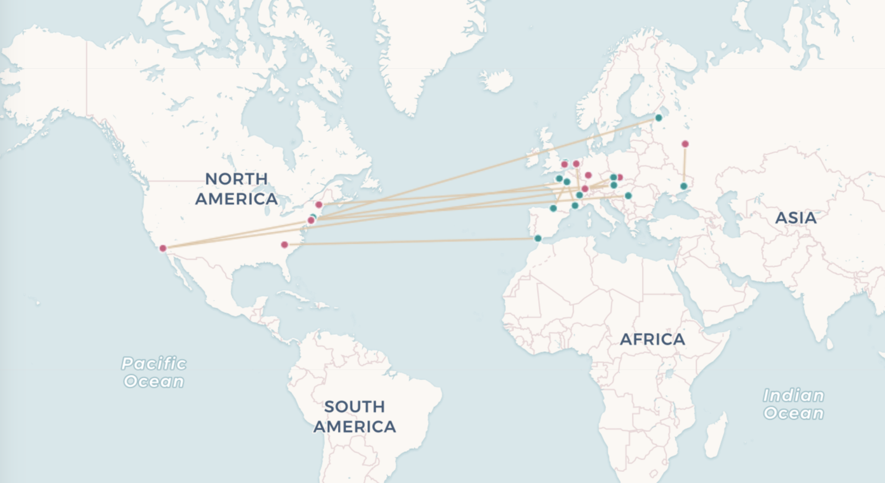

# Composers Map

This map is meant to show the birthplace and death locations of composers. The original interactive map included line features connecting the birth and death locations. Birth and death locations were classified by different coloured markers.

Clicking? Hovering? Filtering?

# Proposed Solution

Starting with qgis2web map (./composers-birth-death/index.html), see if this satisfies the desired map. If not how close are we? What needs to be changed? Are there concerns about the number of files/folders?

Depending on the outcome:

1. Create map document using Leaflet JS/CSS, using a CARTO basemap ([https://github.com/CartoDB/basemap-styles](https://github.com/CartoDB/basemap-styles)). Alternatively Stamen Designs or other OpenStreetMap-based basemap that allows use without API.
2. Use existing GeoJSON data in `./composers-birth-death/data` to create new layers for each composer.
3. Test and implement Leaflet layer controls ([https://leafletjs.com/examples/layers-control/](https://leafletjs.com/examples/layers-control/)). These should:

- display all composers on map load
- have options to displate one or more selected composers from a list, or none.

4. Add to the resulting `composers-map.html` file inline comments inside the `<html>` and `<script>` tags to indicate where and how to make future configurations. This README.md will also include written instructions describing the files/content of this directory.

# Further Explorations

- [https://www.tutorialspoint.com/leafletjs/leafletjs_layers_group.htm](https://www.tutorialspoint.com/leafletjs/leafletjs_layers_group.htm) – Tutorial for working with Leaflet layer groups
- [https://www.npmjs.com/package/leaflet.control.layers.tree](https://www.npmjs.com/package/leaflet.control.layers.tree) - This plugin extends `Control.Layers` allowing a tree structure for the layers layout.
