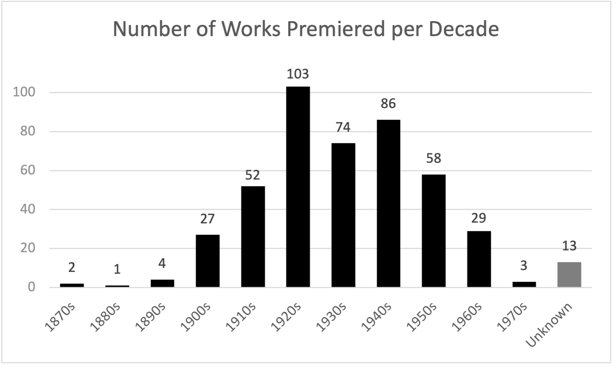

# Timeline Map

This map is meant to show the locations of where certain works premiered over time. All metadata is availble on [FDS_Metadata_1900DS_ArcGIS_18May2019_master] (https://docs.google.com/spreadsheets/d/17rjKQ3lXJHEHAcDfOXTDNX5a0A_jVqwokcaqhd3Ddng/edit?usp=sharing). Corpus Examples are listed anbd associated with links to website example pages [polyrhythm.humdrum.org](https://polyrhythm.humdrum.org/); IDs start with a letter (R or T), followed by a three-digit number. A number of IDs end with an upper-case letter (A, B, C, or D) or a lower-case "x". The timeline slider allows users to interact with the data by rendering events onto the map in a chronological order. 


## Proposed Solutions for creating a timeline map

1. Create map document using Leaflet JS/CSS, using a CARTO basemap ([https://github.com/CartoDB/basemap-styles](https://github.com/CartoDB/basemap-styles)). Alternatively Stamen Designs or other OpenStreetMap-based basemap that allows use without API.
2. Transform a copy of existing csv data into GeoJSON to be queried and displayed as map layer. This GeoJSON file will be stored in this `timeline` directory.
3. Test and implement Leaflet time slider plugin (example: [http://dwilhelm89.github.io/LeafletSlider/](http://dwilhelm89.github.io/LeafletSlider/)).
4. Add to the resulting `timeline-map.html` file inline comments inside the `<html>` and `<script>` tags to indicate where and how to make future configurations. This README.md will also include written instructions describing the files/content of this directory.

## Further Explorations

- [https://github.com/hallahan/LeafletPlayback](https://github.com/hallahan/LeafletPlayback) – This is a Leaflet plug-in that plays back points that have a time stamp synchronized to a clock.
- [https://github.com/skeate/Leaflet.timeline](https://github.com/skeate/Leaflet.timeline) - Display arbitrary GeoJSON on a map with a timeline slider and play button.
- [https://piratefsh.github.io/how-to/2015/10/16/animating-leaflet-markers.html](https://piratefsh.github.io/how-to/2015/10/16/animating-leaflet-markers.html) - Animating Leaflet markers
- [http://boazsobrado.com/blog/2018/02/08/leaflet-timeline-in-r/](http://boazsobrado.com/blog/2018/02/08/leaflet-timeline-in-r/) - Leaflet timeline in R
- [https://www.youtube.com/watch?v=XvKu6_b6aRM](https://www.youtube.com/watch?v=XvKu6_b6aRM) - Learn Leaflet with Mapster - Animation
- [https://leafletjs.com/reference.html#geojson-filter](https://leafletjs.com/reference.html#geojson-filter) - Built-in GeoJSON filtering option
- [https://www.youtube.com/watch?v=x4MGSkw6QnM](https://www.youtube.com/watch?v=x4MGSkw6QnM) - Learn Leaflet with Mapster - Filters (dropdowns)


# Solutions Documentation 
[timeline-boilerplate.html](./timeline-boilerplate.html) provides a basemap for modifying according to the workflows below. 

See [index.html](./index.html) for map with successful timeline slider built referencing code and documentation from [http://dwilhelm89.github.io/LeafletSlider/](http://dwilhelm89.github.io/LeafletSlider/)

1. Convert csv data to geoJSON - drag into https://geojson.io/ to visualize and "Save" in geoJSON format 
2. Add corpus.geojson to appropriate repo folder. Then wrap the data as a variable (simply add `var corpusdata =` before the data on the first line). This will save the file in javascript format. It should now appear as `corpus.js`
3. Open a boilerplate basemap html document. In the body of your html document and within the `<script>` element, your add data to the map as a variable called `testlayer`

```js
var testlayer = L.geoJson(corpusdata).addTo(map);
```
    
To direct your html document to the dataset, also include the following in the <head> element

`<script src="../corpus/corpus.js" charset="utf-8"></script>`

Note: the .. indicates that the source file you are linking is stored in a directory (folder) other than the one you are currently building your map in. If the data were in your working directory, you would link "./corpus.js"  

4. Add the following [jquery](https://jqueryui.com/download/) javascript and CSS file source links to your map document in the head element 

```html

    <!-- Add jquery CSS source-->
    <link
      rel="stylesheet"
      type="text/css"
      href="http://code.jquery.com/ui/1.9.2/themes/base/jquery-ui.css"
    />
        
    <!-- Add jquery ui Javascript sources-->
    <script src="https://code.jquery.com/jquery-1.9.1.min.js"></script>
    <script src="https://code.jquery.com/ui/1.9.2/jquery-ui.js"></script>

```

5. Add the following css style for the slider bar within the document head as well

```html
 <!-- SLIDER CSS -->
    <style>
    #map .slider {
        background: rgba(255, 255, 255, 0.40);
        box-shadow: 0 1px 7px rgba(0, 0, 0, 0.65);
        border-radius: 6px;
        text-align: center;
        padding: 10px 50px 35px 50px;
        position: bottom left;
    }
    </style>
```

6. Create and save a new .js file with the contents of [SliderControl.js](https://github.com/dwilhelm89/LeafletSlider/blob/master/SliderControl.js)
    
To direct your html document to the SliderControl, also include the following in the <head> element
`<script src="./SliderControl.js"></script>`

Open the js file. It should begin with `L.Control.SliderControl = L.Control.extend({` 
    
Replace the preset options with the following:

```js
options: {
        position: 'bottomright',
        timeAttribute: 'premiere_year',
        isEpoch: false,     // whether the time attribute is seconds elapsed from epoch
        startTimeIdx: 0,    // where to start looking for a timestring
        timeStrLength: 4,  // the size of  yyyy-mm-dd hh:mm:ss 
        maxValue: -1,
        minValue: 0,
        showAllOnStart: false,
        markers: null,
        range: true,
        follow: false,
        sameDate: false,
        alwaysShowDate : false,
        rezoom: null
    },
```


7. The rest of the steps involve adding to the `<script>` element within the body of the html document. First, we'll create a data layer which retrieves feature properties from the dataset. Once rendered, these properties will appear as metadata popups on the user end.   

```js
var testlayer = L.geoJSON(corpusdata, {
        onEachFeature: function (feature, layer) {
          if (
            feature.properties &&
            feature.properties.work_title &&
            feature.properties.genre &&
            feature.properties.sub_genre &&
            feature.properties.composition_year &&
            feature.properties.premiere_date &&
            feature.properties.premiere_venue &&
            feature.properties.premiere_city &&
            feature.properties.premiere_country &&
            feature.properties.ensemble &&
            feature.properties.conductor &&
            feature.properties.soloists &&
            feature.properties.example_no_2
          ) {
            layer.bindPopup(
              "<p><b>Premiere Date: </b>" +
                feature.properties.premiere_date +
                "<br><b>Work: </b>" +
                feature.properties.work_title +
                "<br><b>Genre: </b>" +
                feature.properties.genre +
                "<br><b>Sub-genre: </b>" +
                feature.properties.sub_genre +
                "<br><b>Composition Year: </b>" +
                feature.properties.composition_year +
                "<br><b>Premiere Venue: </b>" +
                feature.properties.premiere_venue +
                "<br><b>Premiere City: </b>" +
                feature.properties.premiere_city +
                "<br><b>Premiere Country: </b>" +
                feature.properties.premiere_country +
                "<br><b>Ensemble: </b>" +
                feature.properties.ensemble +
                "<br><b>Conductor: </b>" +
                feature.properties.conductor +
                "<br><b>Soloists: </b>" +
                feature.properties.soloists +
                "<br><b>Corpus Example: </b>" +
                feature.properties.example_no_2 +
                "</p>"
            );
          }
        },
      });
```

8. Create a variable for the sliderControl and add set the layer option to be `testlayer`
```js
var sliderControl = L.control.sliderControl({
         layer: testlayer,
         timeAttribute: "premiere_year",
         range: true,
         position: 'bottomright',
      }).addTo(map);
```

9. Below, add the following function that extracts years from strings
```js
// Create premiere_year properties for markers by extracting
// the year only from premiere_date property. e.g.: "3-Jan-1931"
// will have "1931" extracted from it.
// Note that properties must be strings (not numbers).
      let m = sliderControl.options.markers;
      for (let i=0; i<m.length; i++) {
          let value = m[i].feature.properties.premiere_date;
          let matches = value.match(/(\d{4})/);
          if (matches) {
             m[i].feature.properties.premiere_year = matches[1];
          } else {
             // No invalid premiere_date values in the input data,
             //but just in case, set to the year 3000:
             m[i].feature.properties.premiere_year = "3000";
          }
      }
```

10. Below that, add the following sort function to load features chronologically by premiere_year property
```js
liderControl.options.markers.sort(function (a, b) {
         let A = a.feature.properties.premiere_year;
         let B = b.feature.properties.premiere_year;
         A = parseInt(A);
         B = parseInt(B);
         if (A < B) {
            return -1;
         } else if (A > B) {
            return +1;
         } else {
            return 0;
         }
      });
```

11. Initialize the control
```js
    sliderControl.startSlider();
``` 

12. To save a static image to the slider container and style the container background, edit line 54 of `SliderControl.js` as follows

```js
var sliderContainer = L.DomUtil.create('div', 'slider', this._container);
        $(sliderContainer).append('<div id="leaflet-slider" style="width:300px;"><div class="ui-slider-handle"></div><div id="slider-timestamp" style="width:200px; margin-top:13px; background-color:#FFFFFF; text-align:center; border-radius:5px;"></div>');
```

