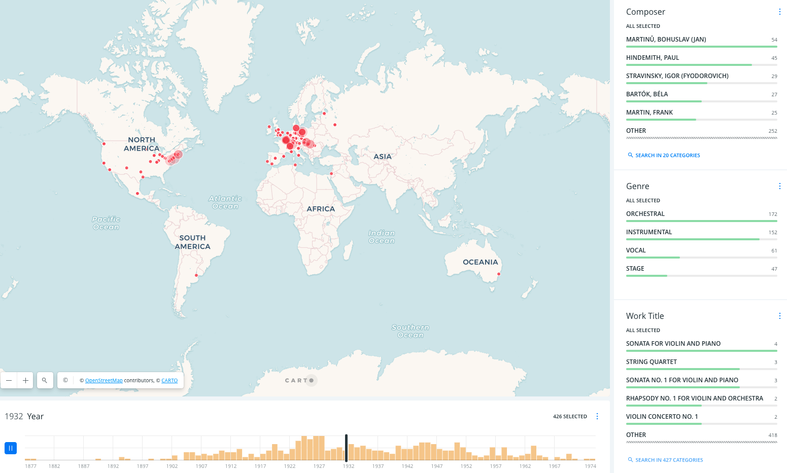

# Timeline Map

This map is meant to show the locations of where certain works premiered over time. All metadata is availble on FDS_Metadata_1900DS_ArcGIS_18May2019_master (https://docs.google.com/spreadsheets/d/17rjKQ3lXJHEHAcDfOXTDNX5a0A_jVqwokcaqhd3Ddng/edit?usp=sharing)

Metadata points for this map include:
- Composer Name
- Work Title
- Genre (Sub-genre)
- Composition Year
- Premiere Year
- Publication Year
- Premiere Location: Venue, City, Country
- Performing Ensemble, Conductor, Soloist(s)
- Corpus Examples

NOTES:
- In cases where the venue in unknown, use "unknown" as data point and use gocoding for city
- In cases where there is no performing ensemble, conductor, or soloist, use "none" or "unknown" as datapoint (refer to FDS master)
- Corpus Examples are listed anbd associated with links to website example pages (https://polyrhythm.humdrum.org/); IDs start with a letter (R or T), followed by a three-digit number. A number of IDs end with an upper-case letter (A, B, C, or D) or a lower-case "x".


The timeline feature allowed users to "play" the map to show locations highlight in the map automatically as the slider moved through time.



# Proposed Solution

1. Create map document using Leaflet JS/CSS, using a CARTO basemap ([https://github.com/CartoDB/basemap-styles](https://github.com/CartoDB/basemap-styles)). Alternatively Stamen Designs or other OpenStreetMap-based basemap that allows use without API.
2. Transform a copy of existing csv data into GeoJSON to be queried and displayed as map layer. This GeoJSON file will be stored in this `timeline` directory.
3. Test and implement Leaflet time slider plugin (example: [http://dwilhelm89.github.io/LeafletSlider/](http://dwilhelm89.github.io/LeafletSlider/)).
4. Add to the resulting `timeline-map.html` file inline comments inside the `<html>` and `<script>` tags to indicate where and how to make future configurations. This README.md will also include written instructions describing the files/content of this directory.

# Further Explorations

- [https://github.com/hallahan/LeafletPlayback](https://github.com/hallahan/LeafletPlayback) – This is a Leaflet plug-in that plays back points that have a time stamp synchronized to a clock.
- [https://github.com/skeate/Leaflet.timeline](https://github.com/skeate/Leaflet.timeline) - Display arbitrary GeoJSON on a map with a timeline slider and play button.
- [https://piratefsh.github.io/how-to/2015/10/16/animating-leaflet-markers.html](https://piratefsh.github.io/how-to/2015/10/16/animating-leaflet-markers.html) - Animating Leaflet markers
- [http://boazsobrado.com/blog/2018/02/08/leaflet-timeline-in-r/](http://boazsobrado.com/blog/2018/02/08/leaflet-timeline-in-r/) - Leaflet timeline in R
- [https://www.youtube.com/watch?v=XvKu6_b6aRM](https://www.youtube.com/watch?v=XvKu6_b6aRM) - Learn Leaflet with Mapster - Animation
- [https://leafletjs.com/reference.html#geojson-filter](https://leafletjs.com/reference.html#geojson-filter) - Built-in GeoJSON filtering option
- [https://www.youtube.com/watch?v=x4MGSkw6QnM](https://www.youtube.com/watch?v=x4MGSkw6QnM) - Learn Leaflet with Mapster - Filters (dropdowns)


## Solutions Documentation 

- [timeline-boilerplate.html](./timeline-boilerplate.html) provides a basemap for modifying according to the workflows below. 
    
### Implementing Leaflet time slider plugin - Method 1

See [timeline-1.html](./timeline-1.html) for map with timeline slider built referencing code and documentation from [http://dwilhelm89.github.io/LeafletSlider/](http://dwilhelm89.github.io/LeafletSlider/)

1. Convert csv data to geoJSON - drag into https://geojson.io/ to visualize and "Save" in geoJSON format 
2. Add data.geojson to appropriate repo folder. Then wrap the data as a variable (simply add `var =` before the data on the first line) and save the file to javascript format. It should now appear as `data.js`
3. In the body of your html document and within the `<script>` element, your add data.js to the map as a variable called `testlayer`

```js
var testlayer = L.geoJson(data).addTo(map);
```
    
To direct your html document to the dataset, also include the following in the <head> element

`<script src="./data.js" charset="utf-8"></script>`

4. Create and save a new .js file with the contents of [SliderControl.js](https://github.com/dwilhelm89/LeafletSlider/blob/master/SliderControl.js)

To direct your html document to the SliderControl, also include the following in the <head> element
`<script src="./SliderControl.js"></script>`

5. Add the following [jquery](https://jqueryui.com/download/) javascript and CSS file source links to your map document in the head element. 

```html

    <!-- Add jquery CSS source-->
    <link
      rel="stylesheet"
      type="text/css"
      href="http://code.jquery.com/ui/1.9.2/themes/base/jquery-ui.css"
    />
        
    <!-- Add jquery ui Javascript sources-->
    <script src="https://code.jquery.com/jquery-1.9.1.min.js"></script>
    <script src="https://code.jquery.com/ui/1.9.2/jquery-ui.js"></script>

    
```

6. The rest of the steps involve adding to the `<script>` element within the body of the html document. Beneath the testlayer variable created to render the data points, copy and paste the contents of `SliderControl.js` This is a sizable chunk of code so you can collapse it once added.  

7. Create a variable for the SliderControl
```js
var sliderControl = L.control.sliderControl({
        position: "topright",
        layer: testlayer,
        range: true
      });
```

8. Add the control to the map
```js
map.addControl(sliderControl);
```

9. Initialize the control
```js
    sliderControl.startSlider();
```
10. Set the dataset property which represents the timestamp of interest. Here it is set to "premiere_data"
```js
$('#slider-timestamp').html(options.markers[ui.value].feature.properties.premiere_date.substr(0, 19));
```

#### Adding metadata popups to map composed w/ Method 1 
To create elementary popups that retrieve a single attribute property for each point on click, replace the initial line of code which sets a variable and adds the data layer as a map object with the following.

```js
var testlayer = L.geoJSON(data, {
        onEachFeature: function (feature, layer) {
          if (
            feature.properties &&
            feature.properties.work_title &&
            feature.properties.premiere_date 
            //to retrieve additional properties  
            // add another '&&' on the last line
            // followed by feature.properties.PROPERTY 
          ) {
            layer.bindPopup(
              "<h4>Premiere Date:" +
                feature.properties.premiere_date +
                "</h4><p>Work: " +
                feature.properties.work_title +
                "</p>"
                //for additional properties to be 
                //displayed in the popup, continue building
                //the expression here
            );
          }
        },
      }).addTo(map);
```
